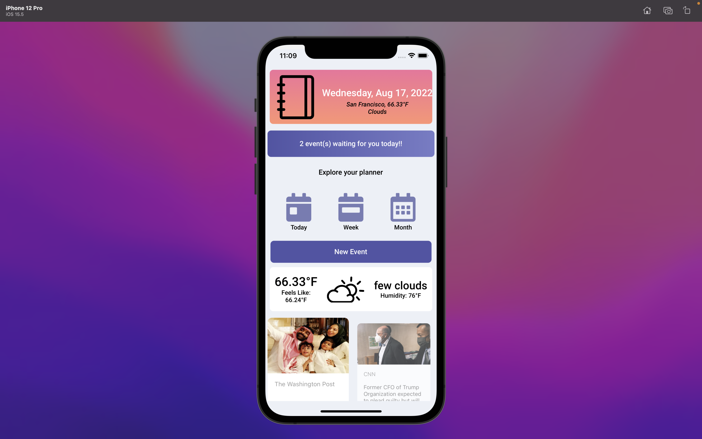

# Midz Calendar

Midz Calendar is a full CRUD Mobile application that stores and handles todos of users using React Native.

---

### Wireframes

---

## Screenshots

### Home Page

## User Stories

### As a user, I want to:
* select a date from the calendar
* create a todo
* view my todos displayed on events page  
* update or delete a todo on card

---

## Technologies Used

* Expo

### API

* WeatherAPI
* NewsAPI

### Backend

* Express
* NodeJS
* Mongoose
* MongoDB

### Frontend

* React Native 
* Materialise Cards
* CSS
* React Vector Icons
* Google Fonts

---

## Getting Started

[Click Here](https://github.com/madhu-mida/react-native-calendar-todo-backend) to see backend Repo.

[Click Here](https://github.com/madhu-mida/react-native-calendar-todo) to see frontend Repo.

[Click Here](https://trello.com/b/30qVxQWJ/rn-midz-calendar) to see trello.

[Click Here](https://expo.dev/@madhumida/rn-calendar-todo?serviceType=classic&distribution=expo-go ) to see deployed expo app.

---

## Future Enhancements

Add Authentication, Authorization