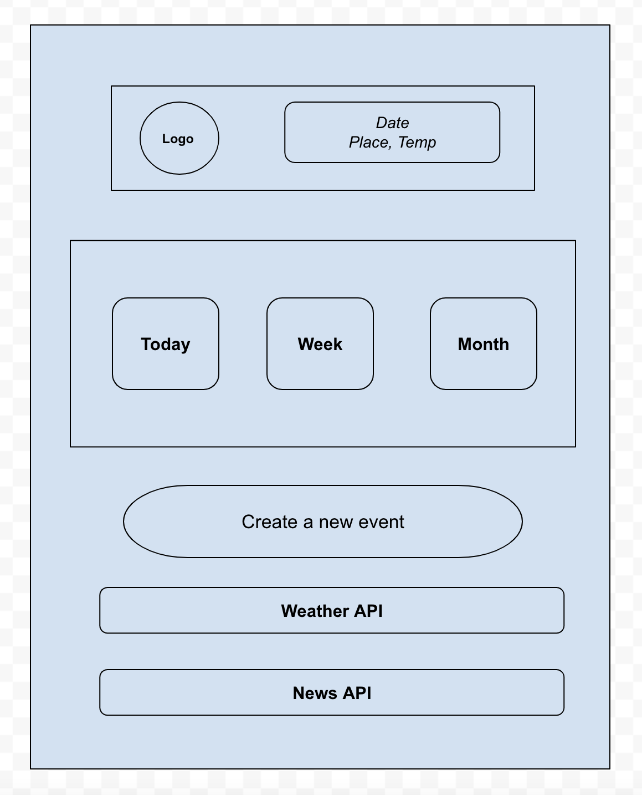
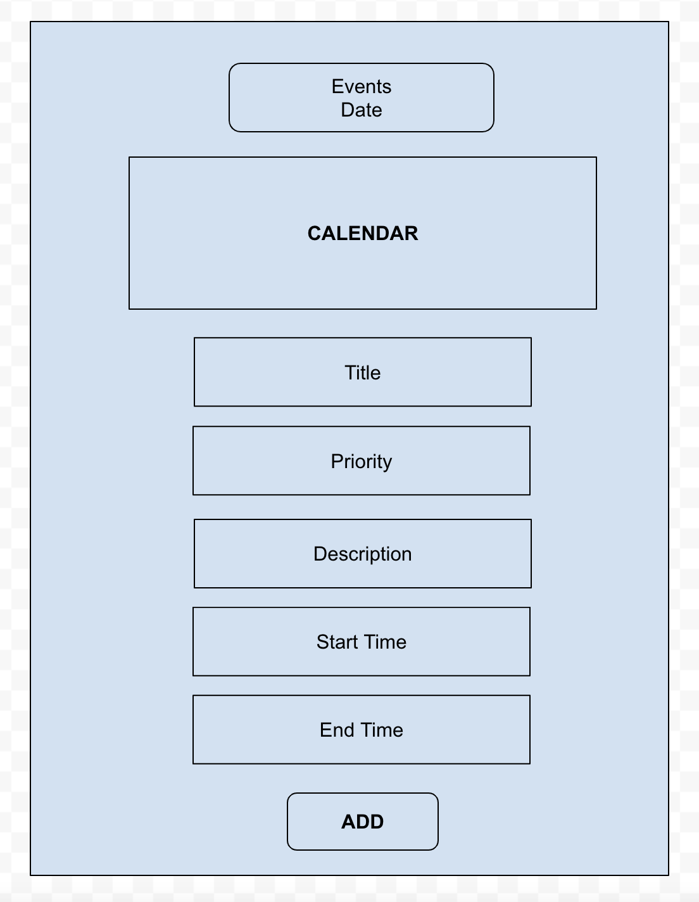
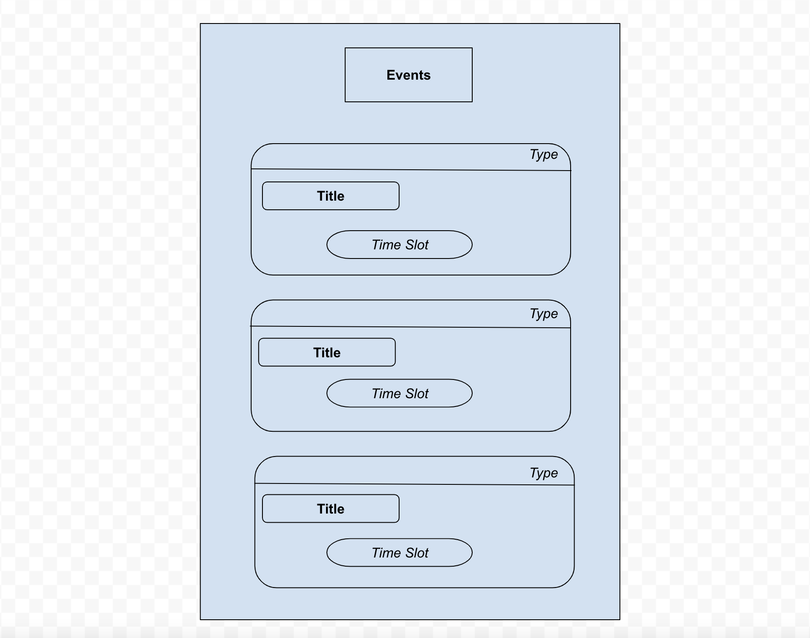

# Midz Calendar

Midz Calendar is a full CRUD Mobile application that stores and handles todos of users using React Native.

---

### Wireframes

### Trello

---

## Screenshots

### Home Page

### Create Page

### Edit Page

### Show Page

## User Stories

### As a user, I want to:
* view my todos displayed on events page.  
* create a todo 
* update or delete a todo on card. 

---

## Technologies Used

Expo

### Backend

Express
NodeJS
Mongoose
MongoDB

### Frontend

React Native 
Materialise Cards
CSS
React Vector Icons

---

## Getting Started

[Click Here](https://github.com/madhu-mida/react-native-calendar-todo-backend) to see backend Repo.

[Click Here](https://github.com/madhu-mida/react-native-calendar-todo) to see frontend Repo.

[Click Here](https://expo.dev/@madhumida/rn-calendar-todo?serviceType=classic&distribution=expo-go ) to see deployed expo app.

---

## Future Enhancements

Add Authentication, Authorization